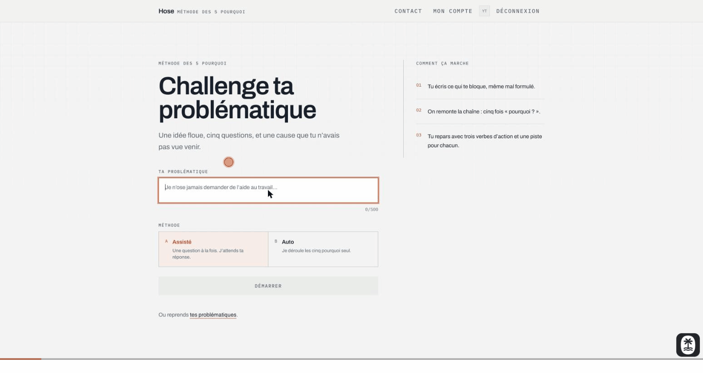
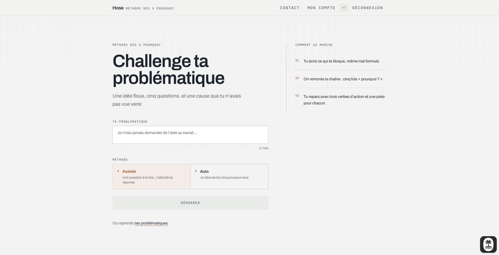
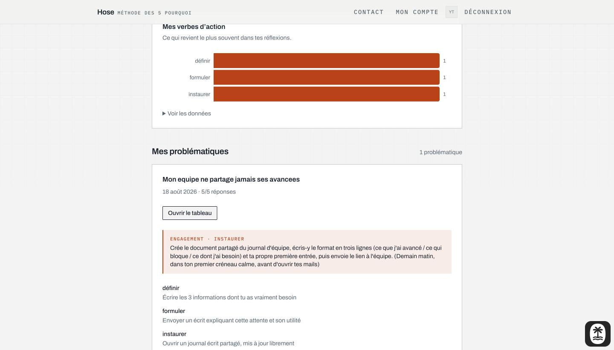

# Hose

_[Version française](README.md)_

Challenge ta problématique. You type a problem you are stuck on, however badly
phrased, and Hose walks it through the **five whys** with you. It ends with
three action verbs, each paired with one concrete thing you could do.

French-language app. Built with TanStack Start, Postgres and Claude.

> This is a rewrite of a 2024 project. The original is archived at
> [`hose-2024-archive`](https://github.com/LSRaGeUx/hose-2024-archive); nothing
> from it was carried over except the idea.

> Portfolio project. It runs locally against a local Postgres and your own
> Claude key. There is no deployed instance.



## How it works

Two modes, both ending at the same place.

- **Assisté** asks one "pourquoi ?" at a time and waits for your real answer.
- **Auto** runs the whole chain unattended so you can react to the result.

Both converge on a synthesis step that produces the three verbs. From there the
run is saved and you get a **tableau**: a canvas that opens already containing
your own reasoning, the problem at the top, the five whys descending, the verbs
fanning out at the bottom.

## A run, end to end

Every screenshot below is a real run against the live model. Nothing is mocked.

**1 · The problem goes on the landing page.** Not behind a button, not in a
modal. The first thing you see is the field you came to fill in.



**2 · You pick how you want to be walked through it.** Assisté by default; Auto
is there for when you do not yet know what to expect from the method.


**3 · In Assisté, one question at a time.** Each answer feeds the next
question, so the chain follows your reasoning rather than a script. Any
question can be swapped for another, and any answer can be edited after the
fact.


**4 · The chain ends in three action verbs.** Each verb comes with one concrete
thing to do, and the advice is written against your own profile: what gives you
energy, what drains you, where you are trying to get to.


**5 · Then you commit to exactly one.** The model proposes a dated, concrete
first step for the verb you chose. You edit it until it is true, then commit.


**6 · The tableau is yours to change.** It opens with the reasoning already
laid out, your profile in the left column and the committed action at the
bottom. From there it is a canvas: move things, connect them, add notes and
actions, undo. Everything saves as you go.


**7 · Mon compte keeps the history.** Every run, the verbs it produced, what
you committed to, and how often each verb has come up across all your problems.



## The rest of it

|                                   |                                            |
| --------------------------------- | ------------------------------------------ |
|  |         |
|    |  |

Dark mode is designed rather than inverted; both surfaces were checked for
contrast.


## Stack

|           |                                                                               |
| --------- | ----------------------------------------------------------------------------- |
| Framework | [TanStack Start](https://tanstack.com/start) (React 19, Vite, TypeScript)     |
| Database  | Postgres via [Drizzle](https://orm.drizzle.team/), local through podman       |
| Auth      | [Better Auth](https://www.better-auth.com), email and password                |
| AI        | [Claude](https://www.anthropic.com) (`claude-opus-5`) with structured outputs |
| Canvas    | [React Flow](https://reactflow.dev)                                           |
| UI        | Tailwind 4, shadcn/ui                                                         |
| Tests     | Vitest, Playwright                                                            |

## Running it

Requires Node 22+ and podman (or Docker, if you adjust `compose.yaml`).

```bash
npm install
cp .env.example .env.local     # then fill it in
npm run db:up                  # Postgres 17 on localhost:5432
npm run db:migrate
npm run db:seed                # optional: one account, two worked-through problems
npm run dev
```

The seed account is `test@hose.local` / `hose-dev-password`.

The only credential you need for the core feature is `HOSE_ANTHROPIC_API_KEY`.
The contact form stays disabled without its Resend keys and says so rather than
pretending to send.

### Why `HOSE_ANTHROPIC_API_KEY` and not `ANTHROPIC_API_KEY`

Netlify's Vite plugin claims `ANTHROPIC_API_KEY` for its own AI Gateway and
writes a site-scoped token into `process.env` when it loads, overwriting
whatever you set. Ours uses a name nothing else takes. The client also pins
`baseURL`, because the SDK otherwise inherits `ANTHROPIC_BASE_URL` from the
environment and calls get proxied to that gateway, which rejects your key.

## Commands

|                                                                |                             |
| -------------------------------------------------------------- | --------------------------- |
| `npm run dev`                                                  | dev server on :3000         |
| `npm run db:up` / `db:down` / `db:nuke`                        | local Postgres              |
| `npm run db:generate` / `db:migrate` / `db:seed` / `db:studio` | schema and data             |
| `npm test`                                                     | unit tests                  |
| `npm run test:e2e`                                             | Playwright, on its own port |
| `npm run lint` / `format` / `check`                            | eslint and prettier         |

## Notes on the design

A few decisions worth knowing about, since they are the difference between this
and the version it replaces.

**The model's output shape is enforced, not requested.** Responses come back
through structured outputs against a schema, so there is no regex, no
`JSON.parse` and no repair step anywhere in the app. Counts are the exception:
the API does not enforce array lengths, so the engine states them in the prompt
and retries with the validation error fed back in.

**Authorization is decided on the server, in the query.** Ownership is part of
the `WHERE` clause, so another user's problem is not found rather than found
and then refused. Route guards run in `beforeLoad`, so a signed-out request is
redirected before any markup is produced.

**A run is saved in one transaction, only once it is complete.** An abandoned
conversation leaves nothing behind, and a partial run cannot be written.

**The chart is one colour.** Every bar measures the same thing, so it is a
single series; a colour per verb would imply a distinction that does not exist.
The hue was validated against both light and dark surfaces rather than picked
by eye.

## Tests

Unit tests cover the five-whys engine against a fake client, so the suite never
spends API tokens or waits on model latency. Playwright covers sign-up, the
server-side guard, sign-out and the not-found state.

Unit tests run in CI against a real Postgres service. The end-to-end suite is a
local command for now: it fails on CI's cold dev server in a way that looks
like hydration not completing, and making it pass by loosening assertions would
defeat the point.

## Licence

GNU General Public License. See [LICENSE](LICENSE).
