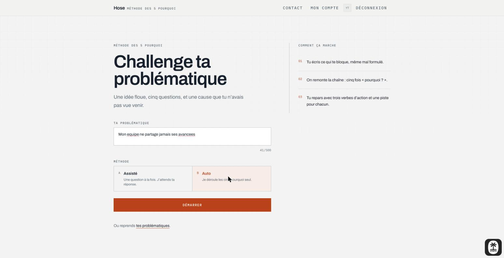
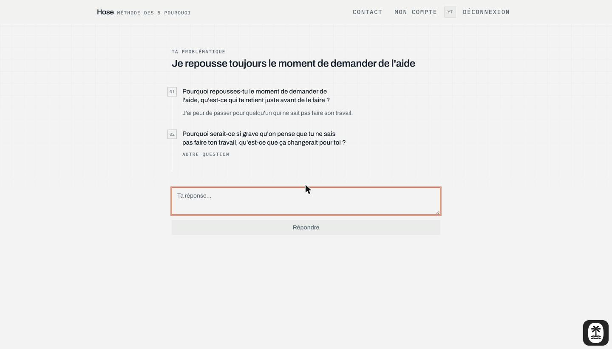
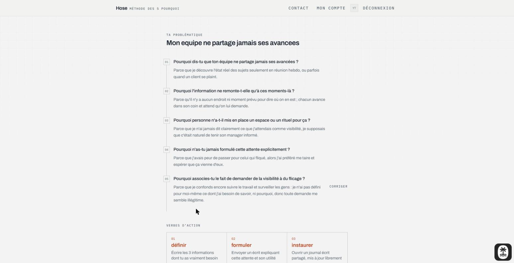
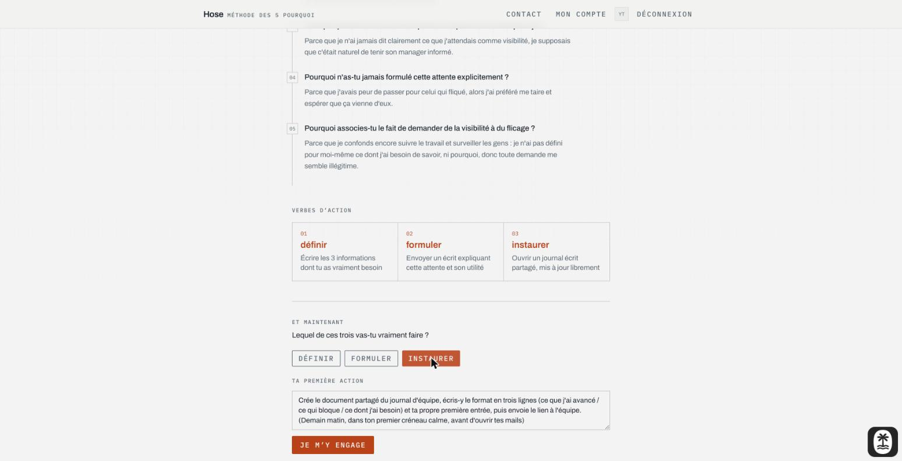
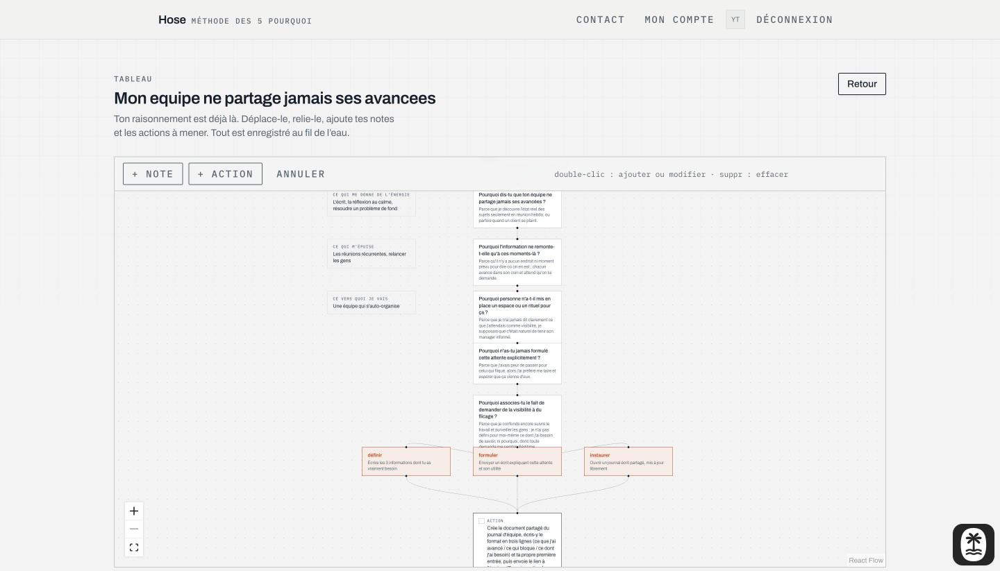
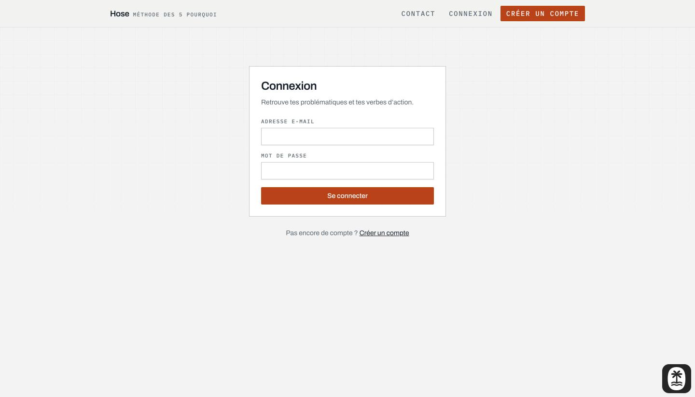
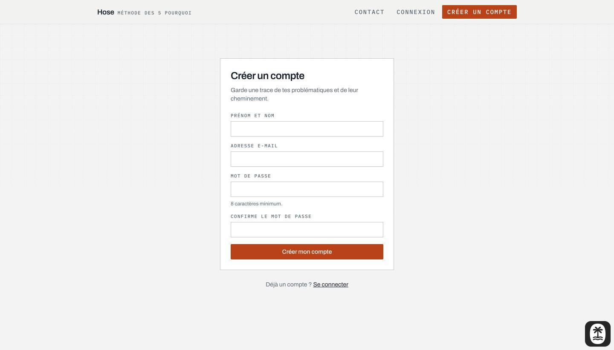
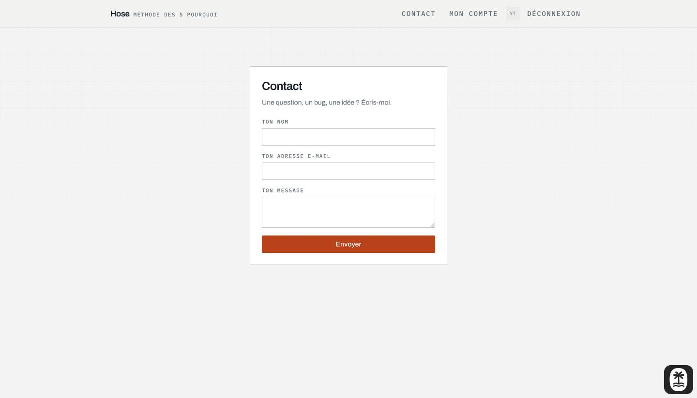
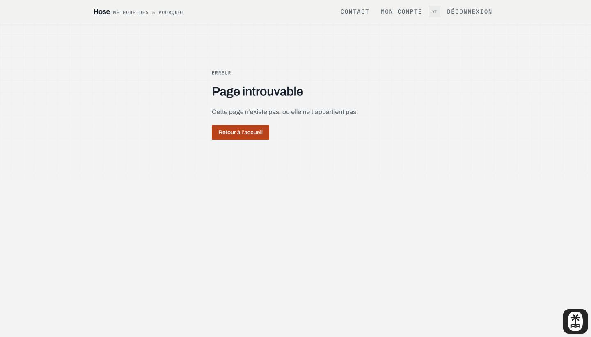
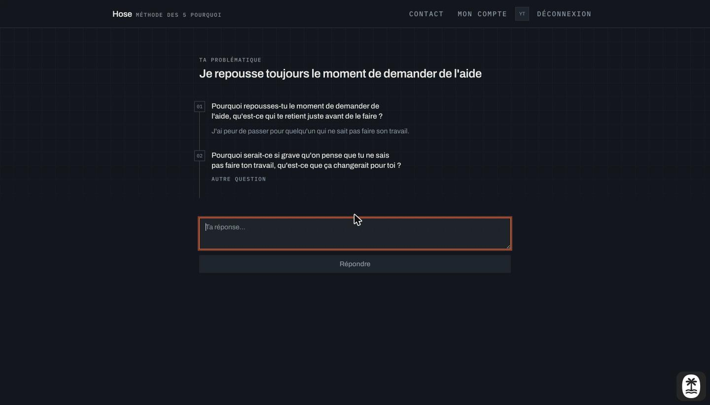

# Hose

_[English version](README.en.md)_

Challenge ta problématique. Tu écris ce qui te bloque, même mal formulé, et Hose
le déroule avec toi selon la **méthode des cinq pourquoi**. À la fin : trois
verbes d'action, chacun accompagné d'une chose concrète à faire.

Application en français. Construite avec TanStack Start, Postgres et Claude.

> Réécriture d'un projet de 2024. L'original est archivé sur
> [`hose-2024-archive`](https://github.com/LSRaGeUx/hose-2024-archive) ; rien
> n'en a été repris, à part l'idée.

> Projet de portfolio. L'app tourne en local, contre un Postgres local et ta
> propre clé Claude. Il n'y a pas d'instance déployée.


## Documentation

Comment l’app est construite, et pourquoi elle l’est comme ça :
[`docs/`](docs/README.md). Architecture, modèle de données, moteur d’IA,
sécurité, tableau, tests, et quatorze décisions structurantes avec leur
contexte et leur coût.

## Le principe

Deux modes, une même destination.

- **Assisté** pose un « pourquoi ? » à la fois et attend ta vraie réponse.
- **Auto** déroule toute la chaîne sans toi, pour que tu réagisses au résultat.

Les deux convergent vers une synthèse qui produit les trois verbes. Le parcours
est alors enregistré et tu obtiens un **tableau** : un canevas qui s'ouvre en
contenant déjà ton propre raisonnement, la problématique en haut, les cinq
pourquoi qui descendent, les verbes en éventail en bas.

## Un parcours, de bout en bout

Toutes les captures ci-dessous viennent d'un vrai parcours contre le modèle en
direct. Rien n'est simulé.

**1 · La problématique est sur la page d'accueil.** Pas derrière un bouton, pas
dans une modale. La première chose que tu vois est le champ que tu es venu
remplir.


**2 · Tu choisis comment tu veux être accompagné.** Assisté par défaut ; Auto
est là pour quand tu ne sais pas encore ce que la méthode peut donner.



**3 · En Assisté, une question à la fois.** Chaque réponse nourrit la question
suivante, donc la chaîne suit ton raisonnement plutôt qu'un script. Toute
question peut être remplacée par une autre, et toute réponse corrigée après
coup.



**4 · La chaîne aboutit à trois verbes d'action.** Chaque verbe vient avec une
chose concrète à faire, et le conseil est écrit en fonction de ton profil : ce
qui te donne de l'énergie, ce qui t'épuise, ce vers quoi tu vas.



**5 · Puis tu t'engages sur un seul.** Le modèle propose un premier pas concret
et daté pour le verbe choisi. Tu le retouches jusqu'à ce qu'il soit juste, puis
tu t'engages.



**6 · Le tableau t'appartient.** Il s'ouvre avec le raisonnement déjà disposé,
ton profil dans la colonne de gauche et l'action engagée en bas. À partir de là
c'est un canevas : déplace, relie, ajoute des notes et des actions, annule.
Tout est enregistré au fil de l'eau.



**7 · Mon compte garde l'historique.** Chaque parcours, les verbes produits, ce
sur quoi tu t'es engagé, et la fréquence de chaque verbe sur l'ensemble de tes
problématiques.


## Le reste

|                                              |                                                            |
| -------------------------------------------- | ---------------------------------------------------------- |
|  |            |
|      |  |

Le thème sombre est conçu, pas inversé ; le contraste a été vérifié sur les
deux fonds.



## Stack

|                 |                                                                            |
| --------------- | -------------------------------------------------------------------------- |
| Framework       | [TanStack Start](https://tanstack.com/start) (React 19, Vite, TypeScript)  |
| Base de données | Postgres via [Drizzle](https://orm.drizzle.team/), en local via podman     |
| Auth            | [Better Auth](https://www.better-auth.com), e-mail et mot de passe         |
| IA              | [Claude](https://www.anthropic.com) (`claude-opus-5`), sorties structurées |
| Canevas         | [React Flow](https://reactflow.dev)                                        |
| UI              | Tailwind 4, shadcn/ui                                                      |
| Tests           | Vitest, Playwright                                                         |

## Lancer le projet

Nécessite Node 22+ et podman (ou Docker, si tu adaptes `compose.yaml`).

```bash
npm install
cp .env.example .env.local     # puis remplis-le
npm run db:up                  # Postgres 17 sur localhost:5432
npm run db:migrate
npm run db:seed                # optionnel : un compte, deux problématiques traitées
npm run dev
```

Le compte de démo est `test@hose.local` / `hose-dev-password`.

La seule clé nécessaire à la fonctionnalité principale est
`HOSE_ANTHROPIC_API_KEY`, et elle est optionnelle. Sans elle l’app démarre
quand même, la connexion fonctionne et toutes les pages s’affichent : le
formulaire de départ est désactivé et annonce que l’assistant est coupé, au
lieu d’accepter une problématique et d’échouer à l’envoi. Le formulaire de
contact se dégrade de la même façon sans ses clés Resend, et le dit au lieu de
faire semblant d’envoyer.

### Pourquoi `HOSE_ANTHROPIC_API_KEY` et pas `ANTHROPIC_API_KEY`

Le plugin Vite de Netlify s'approprie `ANTHROPIC_API_KEY` pour son propre AI
Gateway et écrit un token lié au site dans `process.env` au chargement, en
écrasant ce que tu as défini. Le nôtre porte un nom que rien d'autre ne prend.
Le client fixe aussi `baseURL`, sans quoi le SDK hérite de `ANTHROPIC_BASE_URL`
depuis l'environnement et les appels partent vers ce gateway, qui rejette ta
clé.

## Commandes

|                                                                |                                 |
| -------------------------------------------------------------- | ------------------------------- |
| `npm run dev`                                                  | serveur de dev sur :3000        |
| `npm run db:up` / `db:down` / `db:nuke`                        | Postgres local                  |
| `npm run db:generate` / `db:migrate` / `db:seed` / `db:studio` | schéma et données               |
| `npm test`                                                     | tests unitaires                 |
| `npm run test:e2e`                                             | Playwright, sur son propre port |
| `npm run lint` / `format` / `check`                            | eslint et prettier              |

## Notes de conception

Quelques décisions qui valent d'être connues, puisque ce sont elles qui font la
différence avec la version remplacée.

**La forme des réponses du modèle est imposée, pas demandée.** Les réponses
reviennent par les sorties structurées, validées contre un schéma : aucune
regex, aucun `JSON.parse`, aucune étape de réparation nulle part dans l'app.
Les cardinalités font exception : l'API ne fait pas respecter la longueur des
tableaux, donc le moteur l'énonce dans le prompt et réessaie en réinjectant
l'erreur de validation.

**L'autorisation est décidée côté serveur, dans la requête.** L'appartenance
fait partie du `WHERE`, donc la problématique d'un autre utilisateur n'est pas
trouvée, plutôt que trouvée puis refusée. Les gardes de route s'exécutent dans
`beforeLoad`, donc une requête déconnectée est redirigée avant qu'aucun markup
ne soit produit.

**Une configuration absente est un état, pas un plantage.** La clé Claude comme
les clés Resend sont optionnelles dans le contrat d’environnement, et l’app est
faite pour tourner sans l’une ni l’autre. Le credential est classé dans un seul
module sans imports, lu à la fois par le bundle navigateur et par le moteur,
donc l’état désactivé du formulaire et le refus côté serveur ne peuvent pas
diverger sur l’utilisabilité de la clé.

**Un parcours est enregistré en une seule transaction, et seulement une fois
complet.** Une conversation abandonnée ne laisse rien derrière elle, et un
parcours partiel ne peut pas être écrit.

**Le graphique est monochrome.** Chaque barre mesure la même chose, c'est donc
une série unique ; une couleur par verbe suggérerait une distinction qui
n'existe pas. La teinte a été validée sur les fonds clair et sombre plutôt que
choisie à l'œil.

## Tests

Les tests unitaires couvrent le moteur des cinq pourquoi contre un client
factice, donc la suite ne consomme jamais de tokens et n'attend jamais la
latence du modèle. Playwright couvre l'inscription, la garde côté serveur, la
déconnexion et l'état « page introuvable ».

Les tests unitaires tournent en CI contre un vrai Postgres. La suite end-to-end
reste une commande locale pour l'instant : elle échoue sur le serveur de dev à
froid de la CI, d'une façon qui ressemble à une hydratation qui ne se termine
pas, et la faire passer en relâchant les assertions viderait l'exercice de son
sens.

## Licence

GNU General Public License. Voir [LICENSE](LICENSE).
